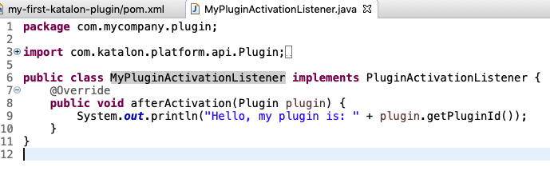
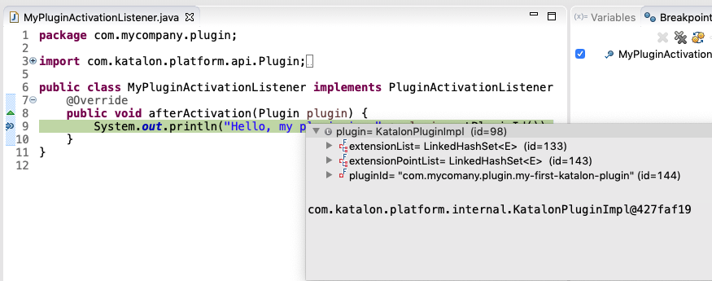

## Debug your plugin using Eclipse IDE
As the previous tutorial, we have announced the how to create platform plugins for Katalon Studio.
This tutorial will illustrate how to debug a platform plugin using Eclipse IDE via [Java Remote Debugging](https://help.eclipse.org/2019-03/topic/org.eclipse.jdt.doc.user/tasks/task-running_and_debugging.htm) feature.

#### Prerequisites:
1. Java SDK 1.8
2. Maven 3.3+
3. Katalon Studio v6.1.0 or later
4. Eclipse IDE (We used Eclipse 4.11 in this article)

### Step 1: Start Katalon Studio with remote debugger mode
Start katalon via commandline using this command:
```sh
<katalon_installed_folder>/katalon -vmargs -Xdebug -Xrunjdwp:transport=dt_socket,server=y,suspend=n,address=8000
```
The `<katalon_installed_folder>` is the absolute path to Katalon installed folder. If you are using macOS, the `<katalon_installed_folder>` should be `/Applications/Katalon Studio.app/Contents/MacOS`.

The `address=8000` is a local port number, JVM will allow a debugger to attach to Katalon Studio via this port. You can change to another port if needed.

### Step 2: Import your platform plugin to Eclipse IDE as a Maven project
In this example, we will use the last tutorial project: [katalon-studio-sample-plugin](https://github.com/katalon-studio/katalon-studio-sample-plugin) to debug.


### Step 3: Set a breakpoint
Open a Java file and set a breakpoint in the code. In this example, we set the breakpoint in the line of class [MyPluginActivationListener](https://github.com/katalon-studio/katalon-studio-sample-plugin/blob/master/src/main/java/com/mycompany/plugin/MyPluginActivationListener.java):
```java
System.out.println("Hello, my plugin is: " + plugin.getPluginId());
```



### Step 4: Create a Java Remote Application Debugger
Click on the arrow dropdown of Eclipse debug icon , choose `Debug Configuration` item.

Right-click on the `Java Remote Application` and choose `New Configuration`


### Step 5: Configure the Java Remote Application Debugger
`Browse` to your platform plugin project at the text field under `Project` section.

Enter the port number you declared at step 1 to the `Port:` text field under `Connection Properties` section.

Click `Debug` to finish setup.

If your setup is correct, there is a  icon will show on Eclipse toolbar.

### Step 6: Import plugin to Katalon Studio and start debugging
Import your plugin and do your expected actions to make the breakpoint you placed at step 2 will be hit.
In this sample, the breakpoint will hit immediately after the plugin succesfiully installed.



Now you can debug your platform plugin project as a normal Java project.

### Step 7: Disconnect and stop debugging
Press the  icon to disconnect and stop your debugging session.